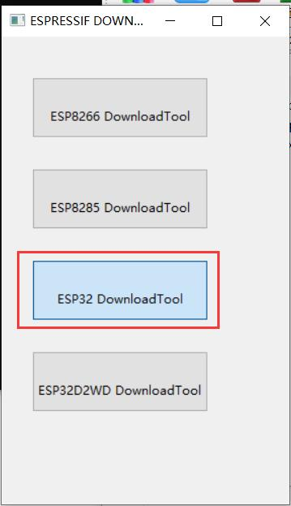

# ESPlay
The game source of ESPlay Micro

Not all the games are tested!

A small trial production started, You can buy it from:
https://www.makerfabs.com/esplay-micro.html

and learn it from:
https://hackaday.io/project/166707-esplay-micro

or
https://github.com/pebri86/esplay-retro-emulation

# ESPlay Micro update V1.0

## Upload

 

1. Unzip ESPlay firmware20191028.rar

2. Insert USB cable to ESPlay USB，install CH340G driver。

3. unzip flash_download_tools_v3.6.6.zip, click flash_download_tools_v3.6.6.exe

4. Select ESP32_DownloadTool

5. Select the correct firmware/bootloader folder path：

Note the correct address：

- phy_init_data.bin——>0xf000
- esplay-base-firmware.bin——>0x10000
- partitions.bin——>0x8000
- bootloader.bin——>0x1000
- SPI Speed is  40Mhz
- SPI Mode is  DIO
- Flash Size is 32Mbit

 

6. Wait a while after click START button

## Test

The test it as bebow：

1. copy esplay and roms folder to root of microsd card.

2. put the card to ESPlay Micro sdcard slot.

3. turn on the board and the bootloader will show list of firmware file available in this case it will only display esplay-retro-emu.fw.

4. To flash the firmware select the file then press A then Start, wait until flashing done then it will automatically restart and boot to application.

5. Place the rom of emulator on roms folder to the appropriate folder example game gear rom to gg folder, gameboy rom to gb folder and so on.